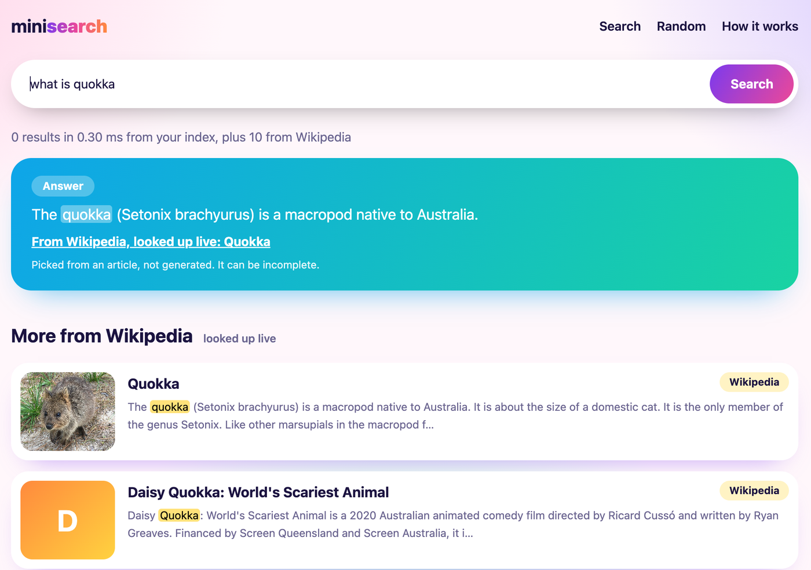

# minisearch

A search engine built from scratch in Python: tokenizer, inverted index, and
BM25 ranking, with no search libraries. Standard library only.

**Live demo:** https://minisearch-dmmy.onrender.com (free hosting, so the first load after a quiet spell can take up to a minute)

## How it works

1. **Tokenize**: lowercase, split on non-alphanumerics, drop stopwords, apply a small suffix stemmer.
2. **Index**: for every term, store which documents contain it and how often (the inverted index).
3. **Rank**: score each candidate document with BM25 (term frequency, inverse document frequency, length normalisation).
4. **Top-k**: keep the best results with a heap instead of sorting every match.

## Try it

    python3 -m venv venv && source venv/bin/activate
    pip install -r requirements.txt
    python -m minisearch "search engine ranking"
    python -m minisearch --dir path/to/your/notes "your query"

## Tests

    python -m pytest -v

## Limitations

- The stemmer is naive (not Porter); it will mis-stem some words.
- No phrase queries, no typo tolerance, no stored positions yet.
- The index lives in memory and is saved as JSON.

## Web UI

    python -m minisearch.crawl     # downloads ~110 Wikipedia article intros and thumbnails
    python -m minisearch.web       # opens at http://127.0.0.1:8000

Pages: search home, ranked results with highlighted snippets, article view with related
articles, and a "How it works" page with live index statistics. The server uses only the
standard library. Article text and images come from Wikipedia (CC BY-SA).

## Answers

The results page shows an **Answer** box when one sentence from the top articles covers
the query's important words. It is extractive: it quotes a sentence and links to its source,
it never generates text, and it stays silent when the corpus cannot answer.

## Phrase matching

The index stores word positions, so queries like "black hole" give a bonus to documents
where the words sit next to each other, in order.

## Benchmark

    python -m minisearch.crawl --random 3000     # about 3,000 more Wikipedia articles (a few minutes)
    python -m minisearch.benchmark               # index vs scanning every document

The benchmark checks that both methods return identical top-10 lists, then prints timings
per corpus size. Paste your own table here:

| Documents | Index (ms/query) | Full scan (ms/query) | Speedup |
|---:|---:|---:|---:|
| 100 | 0.009 | 0.023 | 2x |
| 500 | 0.014 | 0.082 | 6x |
| 1000 | 0.020 | 0.155 | 8x |
| 2000 | 0.033 | 0.303 | 9x |
| 3110 | 0.057 | 0.486 | 8x |

Top-10 BM25 on Wikipedia article intros, 200 two-word queries per size, timed on a MacBook. The full scan is a deliberately optimised baseline. Both methods returned identical top-10 lists for every query. The speedup flattens after about 1,000 articles.

## Live lookup

The local index covers the crawled articles. When it has no good answer for a query, the app
also asks Wikipedia's search API for the top articles, builds a small index over them, and
extracts the best sentence with the same answer code. Those results are labelled
"looked up live" and link to Wikipedia. Wikipedia chooses which articles to return; the
sentence extraction and ranking of the local results are this project's own code.
The live part needs an internet connection and only covers Wikipedia.
